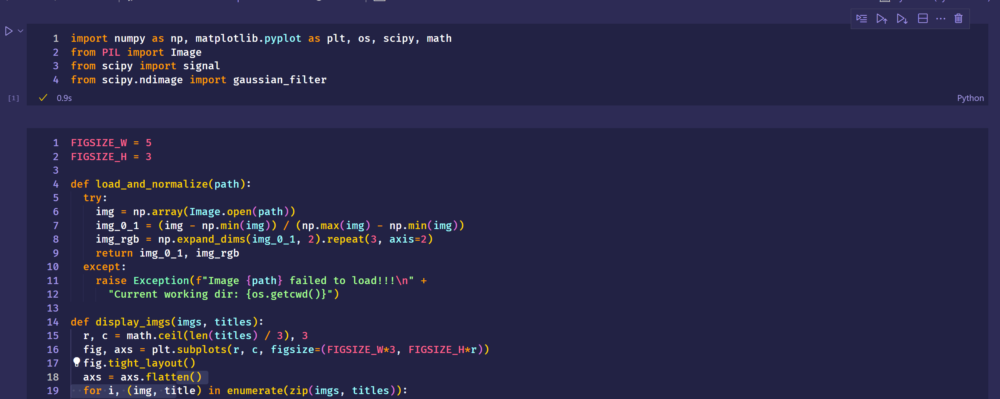
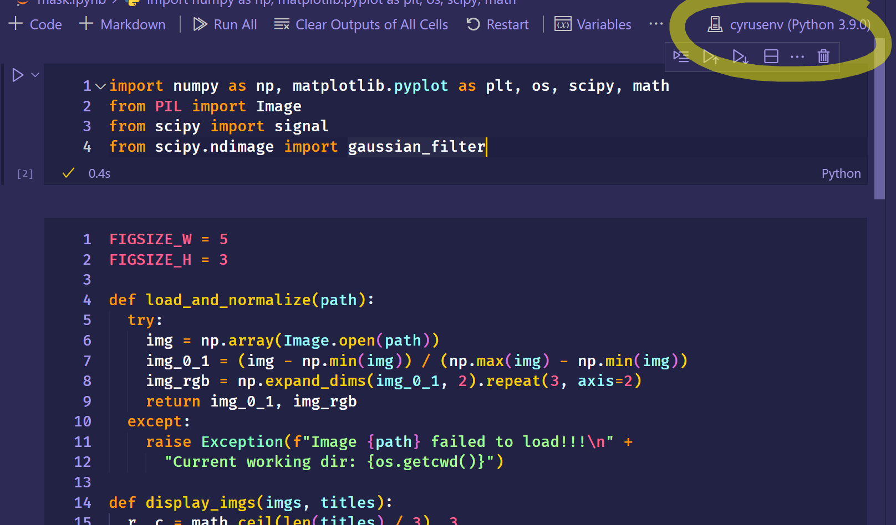

# CYRUS LOOK HERE

1. Install Anaconda, Visual Studio Code, Python from Microsoft Store (maybe)
- test with `conda --version`, `python --version`
2. clone the repository on your desktop
3. `cd` to that directory (use powershell)
   1. `pwd` - tells you where you are
   2. `ls` - tells you what folders/files are in your current directory
   3. `cd <folder>` - change a folder
4. do `conda env create -f environment.yml` when in your working directory
5. wait like 5 minutes
6. do `conda activate cyrusenv`, and you should see a `(cyrusenv)` show up next to your shell
   1. for funsies, you can do `conda deactivate` to get rid of it
7. Launch VSCode
   1. Install some extensions. 
    - Python
    - Jupyter
8. Open `mask.ipynb`
   1. Looks like 
9. Activate the environment
   1.  Click and choose your environment
   2.  
10. Just start running
   1.  Click the |> Arrow to run stuff
   2.  Or just click "Run All" at the top